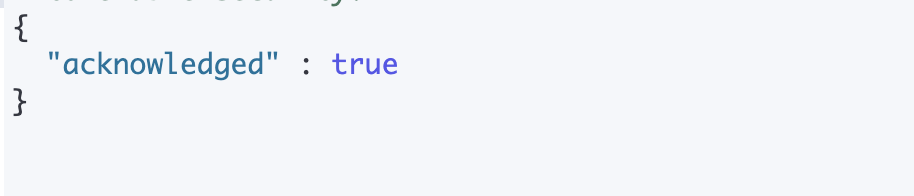
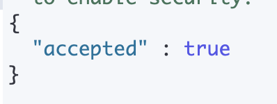
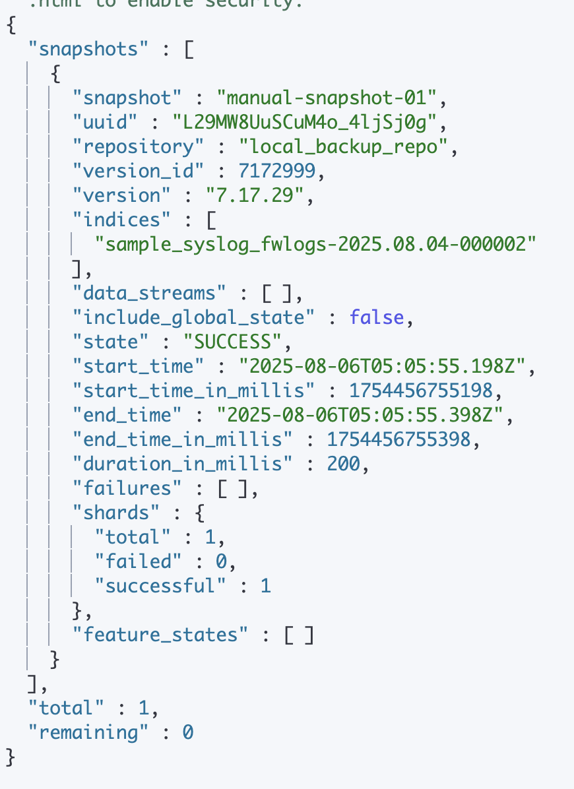
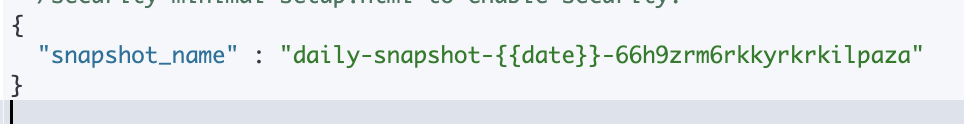
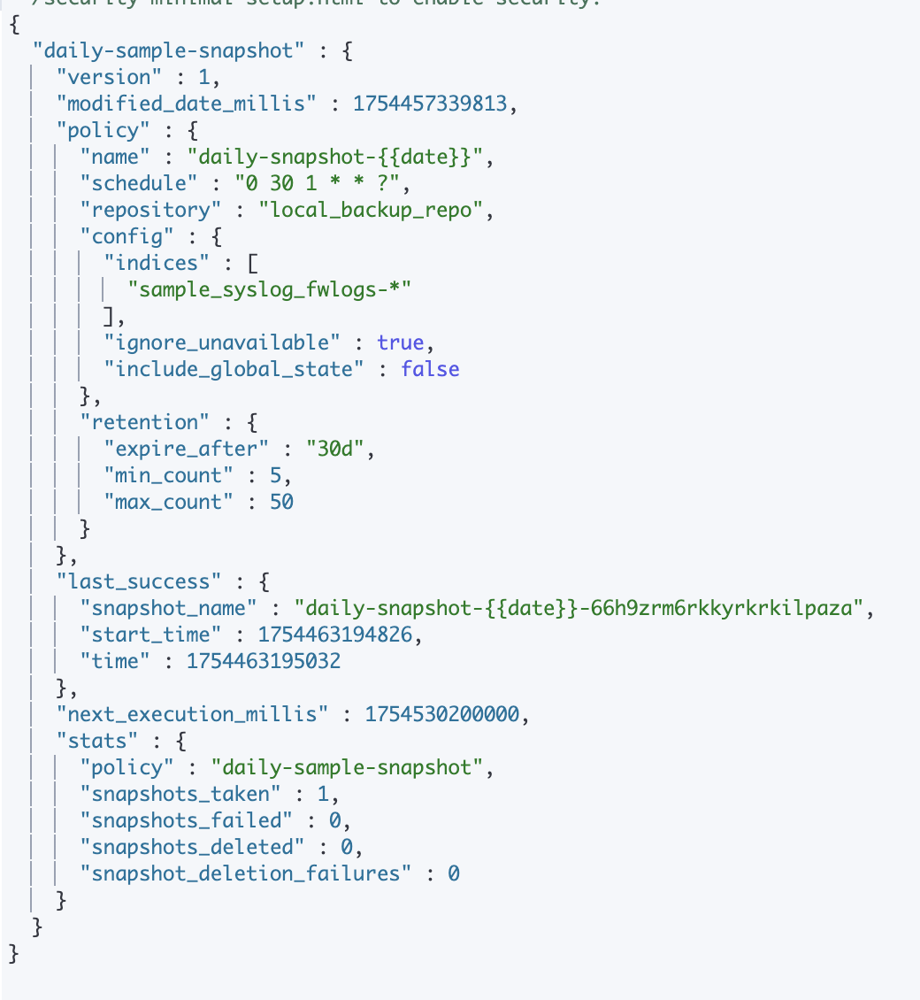
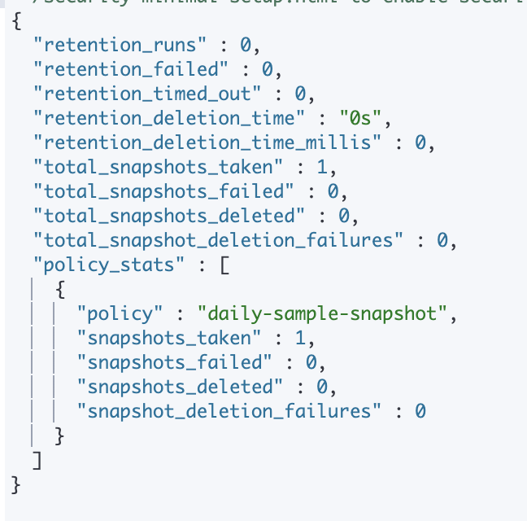
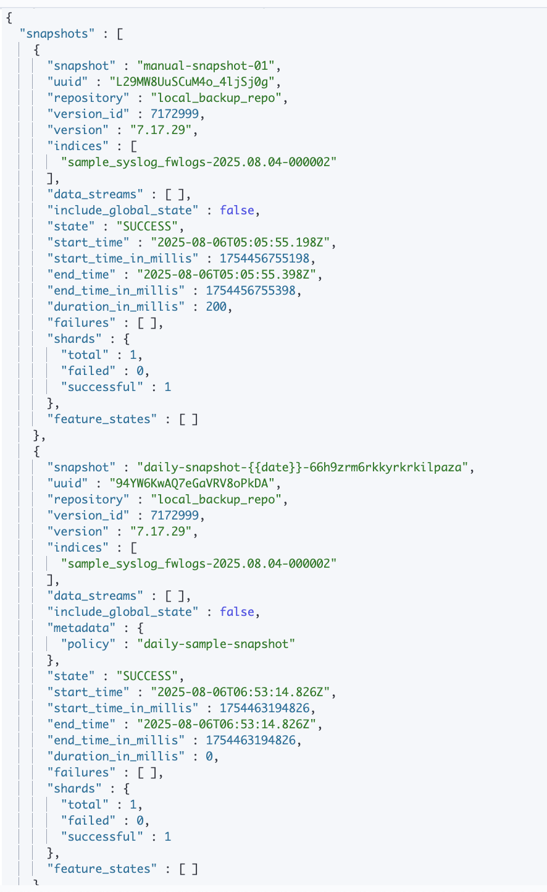
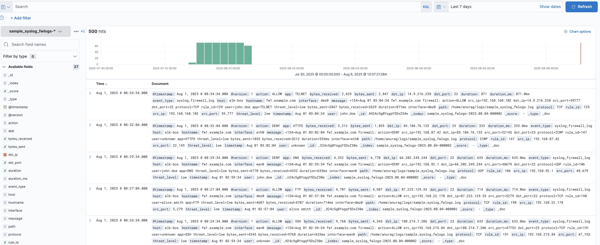

# 📦 Automated Snapshot Backups in Elasticsearch (Simulation)

This document explains how to configure and simulate **automated snapshot backups** in your Elasticsearch environment. Snapshots are critical for **disaster recovery**, **index recovery**, and **data retention**.

---

## 🧠 What Are Snapshots?

- Snapshots are **incremental backups** of indices and cluster state.
- They can be stored in **shared file systems** or cloud storage.
- Useful for restoring deleted or corrupted indices.

---

## ⚙️ 1. Prerequisites

### ✅ Create a directory for snapshots

```bash
sudo mkdir -p /mnt/elastic-backups
sudo chown -R elasticsearch:elasticsearch /mnt/elastic-backups
```

### Add path.repo to elasticsearch.yml
```yaml
# /etc/elasticsearch/elasticsearch.yml
path.repo: ["/mnt/elastic-backups"]
```

restart elasticsearch after change:
```bash
sudo systemctl restart elasticsearch
```

## Register a Snapshot Repository

```json
PUT _snapshot/local_backup_repo
{
  "type": "fs",
  "settings": {
    "location": "/mnt/elastic-backups",
    "compress": true
  }
}
```


## Create a manual snapshot (optional)
To verify the setup works before enabling automation:
```json
PUT /_snapshot/local_backup_repo/manual-snapshot-01
{
  "indices": "sample_syslog_fwlogs-*",
  "ignore_unavailable": true,
  "include_global_state": false
}
```


### verify the snapshot
```http
GET /_snapshot/local_backup_repo/_all
```


## Automate Snapshots Using SLM (Snapshot Lifecycle Management)
This requires x-pack features (available in default Elastic distribution).

### Define SLM Policy
```json
PUT _slm/policy/daily-sample-snapshot
{
  "schedule": "0 30 1 * * ?", 
  "name": "daily-snapshot-{{date}}",
  "repository": "local_backup_repo",
  "config": {
    "indices": ["sample_syslog_fwlogs-*"],
    "ignore_unavailable": true,
    "include_global_state": false
  },
  "retention": {
    "expire_after": "30d",
    "min_count": 5,
    "max_count": 50
  }
}

```
Schedule: Runs every day at 1:30 AM.

Retention: Keeps minimum 5 and maximum 50 snapshots, or those younger than 30 days.

**{{date}} gets replaced with the current date/time in ISO format at snapshot creation.**

**You can also use {{now}} or {{yyyy.MM.dd}} if you want a custom timestamp format.**


#### you can trigger it manually for testing (optional)
```json
POST _slm/policy/daily-sample-snapshot/_execute
```


## Monitor Snapshot
### check policy history
```bash
GET _slm/policy/daily-sample-snapshot
```

### check snapshot history
```json
GET _slm/stats
```

### view existing snapshot
```bash
GET _snapshot/local_backup_repo/_all
```


**specific snapshot**
```bash
GET _snapshot/local_backup_repo/daily-sample-snapshot-*
```


### snapshot status
```bash
GET _snapshot/local_backup_repo/_status
```

## Restore Snapshot
```json
POST /_snapshot/local_backup_repo/manual-snapshot-01/_restore
{
  "indices": "sample_syslog_fwlogs-*",
  "rename_pattern": "sample_syslog_fwlogs-(.+)",
  "rename_replacement": "restored_fwlogs-$1"
}
```
**restoring snapshots using patterns like this can clutter your cluster with multiple restored indices unless you're managing them carefully.**

If you only need the data for short-term investigation or testing, restore everything into a single index like:
```json
POST /_snapshot/local_backup_repo/manual-snapshot-01/_restore
{
  "indices": "sample_syslog_fwlogs-2025.01.15",
  "rename_pattern": "sample_syslog_fwlogs-(.+)",
  "rename_replacement": "restored_fwlogs_temp"
}
```

### Cleanup after use
```http
DELETE restored_fwlogs_temp
```

Elasticsearch restores to the exact same index names of snapshot
```json
POST _snapshot/local_backup_repo/manual-snapshot-01/_restore
{
  "indices": "sample_syslog_fwlogs-*",
  "include_global_state": false
}
```


restoration successfull



## Delete Snapshot (If needed)
```json
DELETE _snapshot/local_backup_repo/manual-snapshot-01
```
