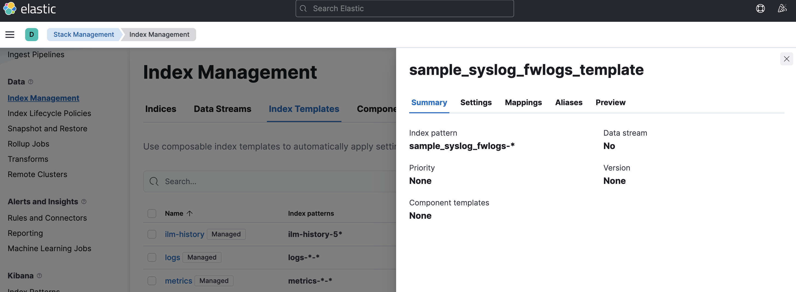
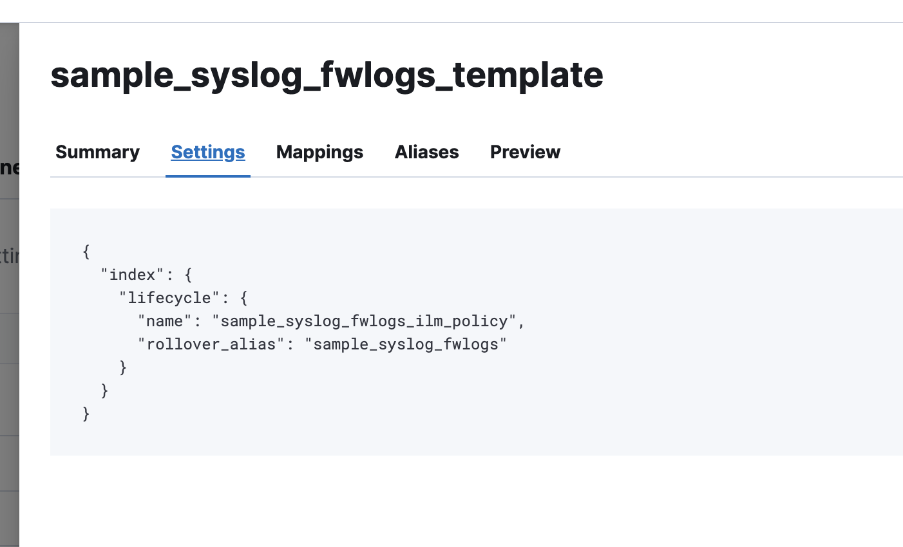
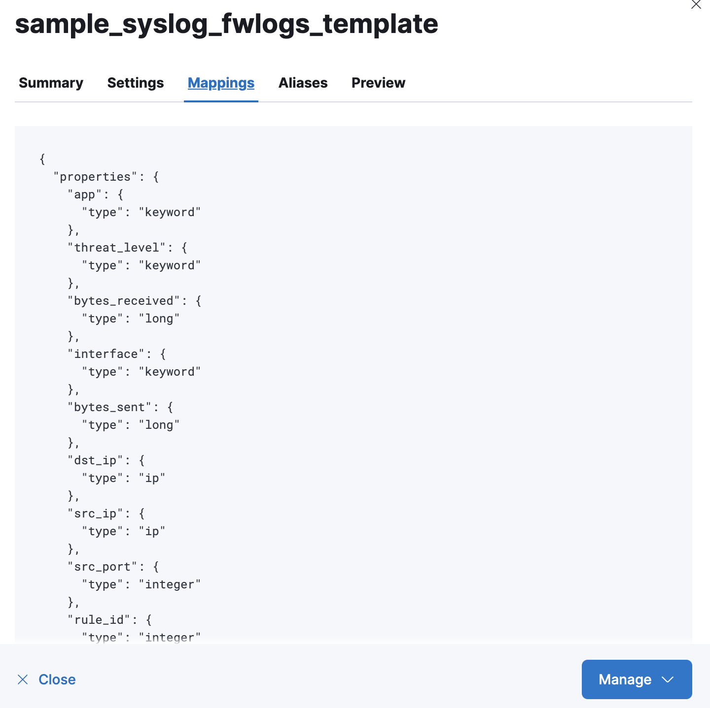
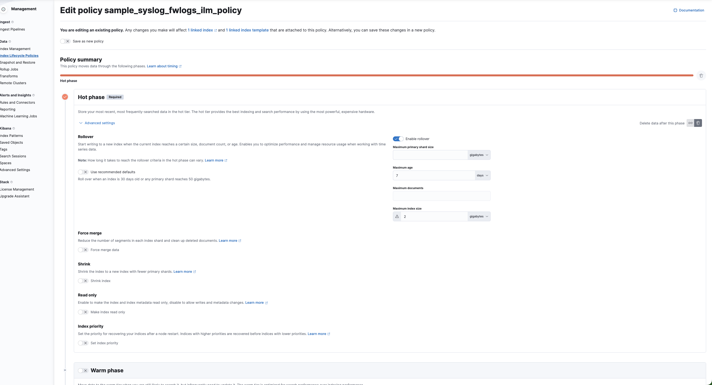
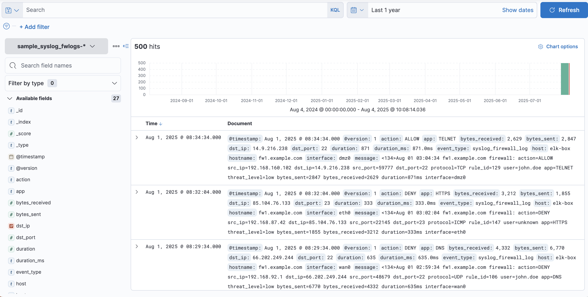

# Logstash Pipeline Configuration and Firewall Log Ingestion

This document captures the setup and configuration of a Logstash pipeline to ingest, parse, and forward sample syslog-style firewall logs to Elasticsearch. The logs are structured, stored with ILM, and visualized in Kibana.

---

## 📁 Directory Structure

Although the common practice is to store pipeline configs in `/etc/logstash/conf.d/`, during development we use:

~/config/


This allows easier version control and local editing. We run Logstash manually using:

```bash
sudo /usr/share/logstash/bin/logstash -f /home/anurag/config/sample_syslog_pipeline.conf --path.data ./sample_fwlogs_logstash_data
```

## Input configuration file

```conf
input {
  file {
    path => "/home/anurag/logs/sample_syslog_fwlogs.log"
    start_position => "beginning"
    sincedb_path => "/home/anurag/config/sample_fwlogs_logstash_data/sample_fwlogs"
  }
}
```

### notes

start_position => "beginning" ensures Logstash reads from the top only the first time.

sincedb_path is used to persist file read state. To reprocess logs, delete this file:

```bash
rm /home/anurag/config/sample_fwlogs_logstash_data/sample_fwlogs
```

## Filter Configuartion (Parsing Logs)

We can use Grok/dissect filter to parse the log pattern, then enrich fields:


```conf
filter {
  grok {
    match => {
      "message" => "<%{NUMBER:syslog_pri}>%{SYSLOGTIMESTAMP:timestamp} %{HOSTNAME:hostname} firewall: action=%{WORD:action} src_ip=%{IP:src_ip} dst_ip=%{IP:dst_ip} src_port=%{INT:src_port} dst_port=%{INT:dst_port} protocol=%{WORD:protocol} rule_id=%{INT:rule_id} user=%{USERNAME:user} app=%{WORD:app} threat_level=%{WORD:threat_level} bytes_sent=%{INT:bytes_sent} bytes_received=%{INT:bytes_received} duration=%{NUMBER:duration}ms interface=%{WORD:interface}"
    }
  }

  date {
    match => ["timestamp", "MMM dd HH:mm:ss"]
    target => "@timestamp"
    timezone => "UTC"
  }

  mutate {
    add_field => {
      "event_type" => "syslog_firewall_log"
      "duration_ms" => "%{duration}ms"
    }
    convert => {
      duration => "integer"
    }
    remove_field => ["syslog_pri"]
  }
}
```

### sample log
```log
<134>Jul 31 06:17:04 fw1.example.com firewall: action=ALLOW src_ip=192.168.239.203 dst_ip=149.15.231.198 src_port=32977 dst_port=23 protocol=UDP rule_id=186 user=alice.smith app=DNS threat_level=low bytes_sent=5870 bytes_received=7377 duration=674ms interface=eth0
<134>Jul 31 06:19:34 fw1.example.com firewall: action=ALLOW src_ip=192.168.81.161 dst_ip=157.132.190.149 src_port=26330 dst_port=53 protocol=UDP rule_id=163 user=unknown app=SSH threat_level=low bytes_sent=7558 bytes_received=4053 duration=330ms interface=dmz0
<134>Jul 31 06:22:04 fw1.example.com firewall: action=DENY src_ip=192.168.145.180 dst_ip=33.95.250.7 src_port=48437 dst_port=23 protocol=ICMP rule_id=192 user=bob.jones app=FTP threat_level=medium bytes_sent=561 bytes_received=3001 duration=978ms interface=dmz0
<134>Jul 31 06:24:34 fw1.example.com firewall: action=DENY src_ip=192.168.82.112 dst_ip=191.98.178.160 src_port=43140 dst_port=443 protocol=TCP rule_id=131 user=unknown app=TELNET threat_level=low bytes_sent=9180 bytes_received=5235 duration=76ms interface=wan0
```

## Output to Elasticsearch (ILM + Rollover Alias)

```conf
output {
  elasticsearch {
    hosts => ["http://localhost:9200"]
    index => "sample_syslog_fwlogs"
    ilm_enabled => true
    ilm_rollover_alias => "sample_syslog_fwlogs"
    ilm_policy => "sample_syslog_fwlogs_ilm_policy"
  }
}
```
This ensures logs are stored with rollover and deletion rules using ILM.

## Index Template for Mappings and ILM
Created using Dev Tools in Kibana:

```json
PUT _index_template/sample_syslog_fwlogs_template
{
  "index_patterns": ["sample_syslog_fwlogs-*"],
  "template": {
    "settings": {
      "index.lifecycle.name": "sample_syslog_fwlogs_ilm_policy",
      "index.lifecycle.rollover_alias": "sample_syslog_fwlogs"
    },
    "mappings": {
      "properties": {
        "@timestamp":     { "type": "date" },
        "src_ip":         { "type": "ip" },
        "dst_ip":         { "type": "ip" },
        "src_port":       { "type": "integer" },
        "dst_port":       { "type": "integer" },
        "protocol":       { "type": "keyword" },
        "rule_id":        { "type": "integer" },
        "user":           { "type": "keyword" },
        "app":            { "type": "keyword" },
        "threat_level":   { "type": "keyword" },
        "bytes_sent":     { "type": "long" },
        "bytes_received": { "type": "long" },
        "duration":       { "type": "float" },
        "duration_ms":    { "type": "keyword" },
        "interface":      { "type": "keyword" },
        "event_type":     { "type": "keyword" },
        "hostname":       { "type": "keyword" }
      }
    }
  }
}
```





### ILM Policy (7d/2gb rollover, delete after 30d)

```json
PUT _ilm/policy/sample_syslog_fwlogs_ilm_policy
{
  "policy": {
    "phases": {
      "hot": {
        "min_age": "0ms",
        "actions": {
          "rollover": {
            "max_size": "2gb",
            "max_age": "7d"
          }
        }
      },
      "delete": {
        "min_age": "30d",
        "actions": {
          "delete": {
            "delete_searchable_snapshot": true
          }
        }
      }
    }
  }
}
```

## Debugging and Retesting

To see parsed events in terminal
```conf
output {
  stdout { codec => rubydebug }
}
```

To reprocess logs from scratch
```bash
rm /home/anurag/config/sample_fwlogs_logstash_data/sample_fwlogs
```

## Index Pattern Discover
Ensure default index pattern is created manually from Kibana if not auto-populated.

