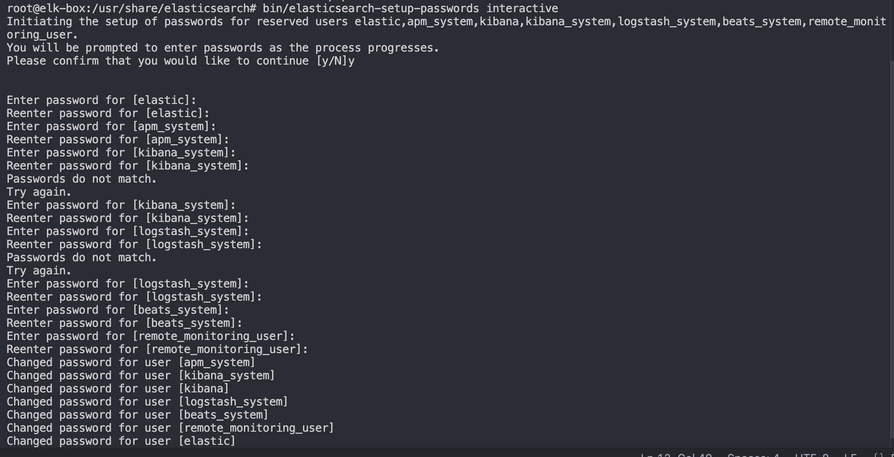
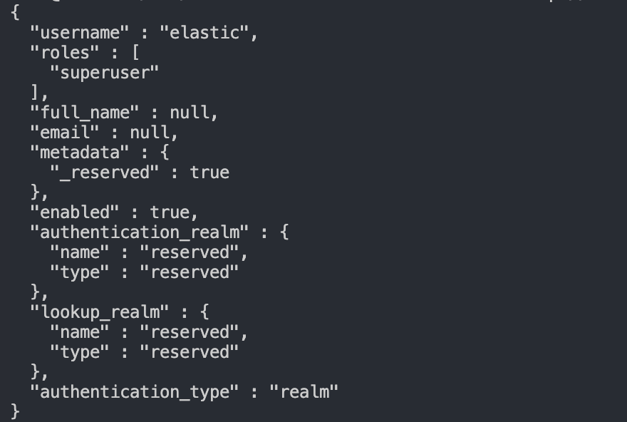
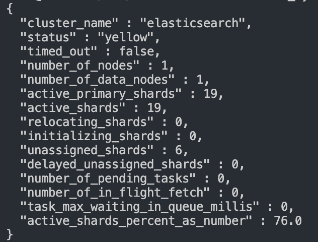

# Enable Minimal Security for Lab

## 1. Enable Security
Add to your elasticsearch.yml in 9.x
```yml
xpack.security.enabled: true
```
Restart elasticsearch
```bash
systemctl restart elasticsearch
```

if any error encountered, check logs

```bash
sudo tail -n 50 /var/log/elasticsearch/elasticsearch.log
```

## 2. Setup built-in password
Run the interactive password tool (this sets elastic, kibana_system, logstash_system, beats_system, …)
```bash
sudo /usr/share/elasticsearch/bin/elasticsearch-setup-passwords interactive
```


## 3. Update Kibana's kibana.yml
```yml
elasticseach.hosts: ["http://localhost:9200"]
elasticsearch.username: "kibana_system"
elasticsearch.password: "your_password"
```
restart kibana

```bash
systemctl restart kibana
```

## 4. Test Authentication & Cluster
### Test elastic admin
```bash
curl -u elastic:'<elastic_password>' 'http://localhost:9200/_security/_authenticate?pretty'
```


### Test kibana_system (just a cluster health check via user)
```bash
curl -u kibana_system:'<kibana_system_password>' 'http://localhost:9200/_cluster/health?pretty'
```
