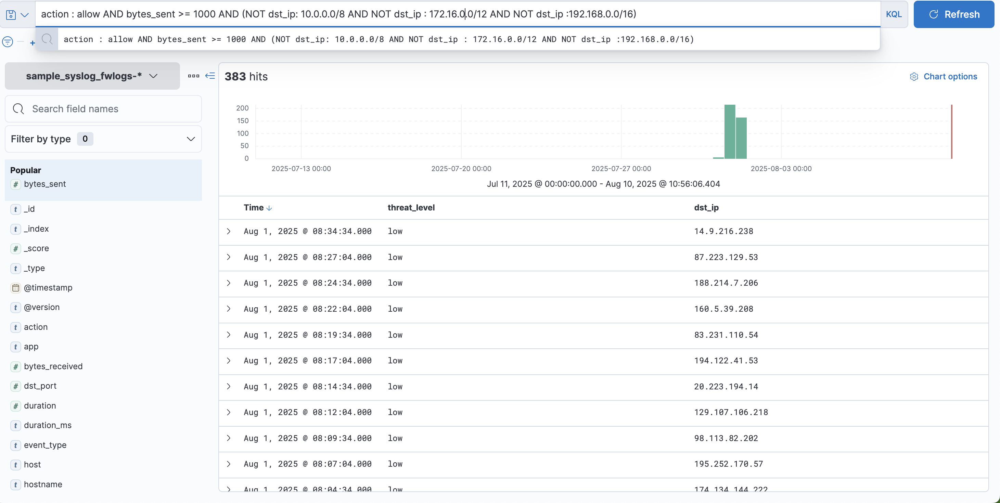

# ElastAlert Rule: Potential Data Exfiltration

## Objective
This rule is designed to detect potential **data exfiltration attempts** by monitoring large outbound data transfers from internal IP addresses to external destinations over a short period of time.  
It correlates traffic volume (`bytes_sent`) with the destination IP category (internal vs. external) to raise alerts when unusual transfer activity occurs.

---

## Rule File Path
[potential data exfiltration](/Elastalet%20Alert%20Rules/potential_data_exfiltration.yaml)

---

## Prerequisites
Before creating the rule, ensure:
1. **ElastAlert 2** is installed and configured to connect to Elasticsearch.
2. The firewall log index pattern `sample_syslog_fwlogs-*` exists and is actively ingesting parsed log data.
3. The fields below exist in the logs:
   - `src_ip`
   - `dst_ip`
   - `bytes_sent`
   - `action`
   - `protocol`
   - `timestamp`
4. An updated `config.yaml` for ElastAlert with:
   - Proper `es_host` and `es_port`
   - Reasonable `run_every` and `buffer_time` values
   - Alerting method configured (email, Slack, debug, etc.)

---

## Detection Logic
The rule triggers if:
- `bytes_sent` is greater than **50 MB** (configurable threshold) **AND**
- `dst_ip` is external (not in RFC1918 private ranges) **AND**
- The action is `ALLOW`  
- This activity occurs **within 5 minutes** per source IP.

---

## Steps to Create the Rule

### 1. Identify External Traffic
We consider any destination IP **outside** `10.0.0.0/8`, `172.16.0.0/12`, and `192.168.0.0/16` as external.  
This filtering will be implemented inside the query.

---

### 2. Define Rule Parameters
- **Type:** `frequency`  
- **Index:** `sample_syslog_fwlogs-*`  
- **Timeframe:** 5 minutes  
- **Threshold:** 1 occurrence (per timeframe) where `bytes_sent > 50MB` and `dst_ip` is external.

---

### 3. Create Rule File
Save the following to:
`/ElastAlert Alert Rules/potential_data_exfiltration.yaml`

```yaml
name: Potential Data Exfiltration
type: frequency
index: sample_syslog_fwlogs-*
num_events: 1
timeframe:
  minutes: 5

filter:
  - range:
      bytes_sent:
        gte: 52428800  # 50 MB in bytes
  - term:
      action: "ALLOW"
  - bool:
      must_not:
        - regexp:
            dst_ip: "^(10\\.|172\\.(1[6-9]|2[0-9]|3[0-1])\\.|192\\.168\\.)"

query_key: src_ip

alert:
  - debug
  # Example: Uncomment to send email
  # - "email"
  # email:
  #   - "soc-team@example.com"

alert_text: |
  Potential data exfiltration detected from {0}.
  Bytes sent: {1}
  Destination IP: {2}

alert_text_args:
  - src_ip
  - bytes_sent
  - dst_ip

alert_text_type: alert_text_only
```

### 4. Test the Rule
Run ElastAlert in test mode:
```bash
elastalert-test-rule /ElastAlert\ Alert\ Rules/potential_data_exfiltration.yaml
```

### 5. Verify the Rule
#### hits in kibana


### 6. Enable the Rule
Start ElastAlert:
```bash
elastalert --verbose
```


### 7. Improvement for Production
Implement IP reputation lookups for dst_ip to identify known malicious hosts.

Correlate with app field to detect risky applications (FTP, TELNET, etc.).

Use a cardinality aggregator to check unique destination count per user.
