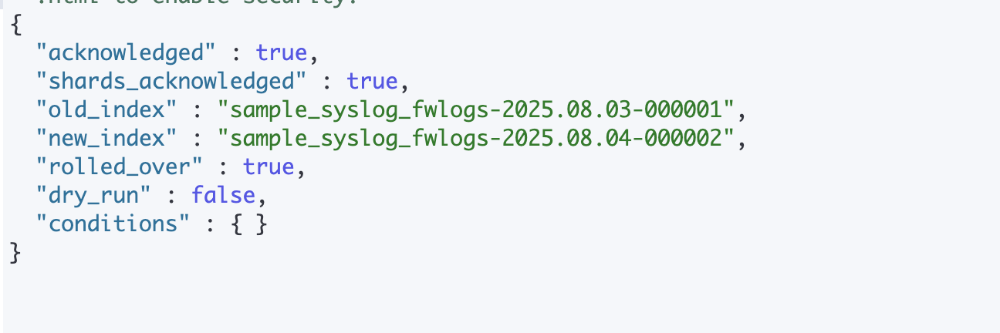
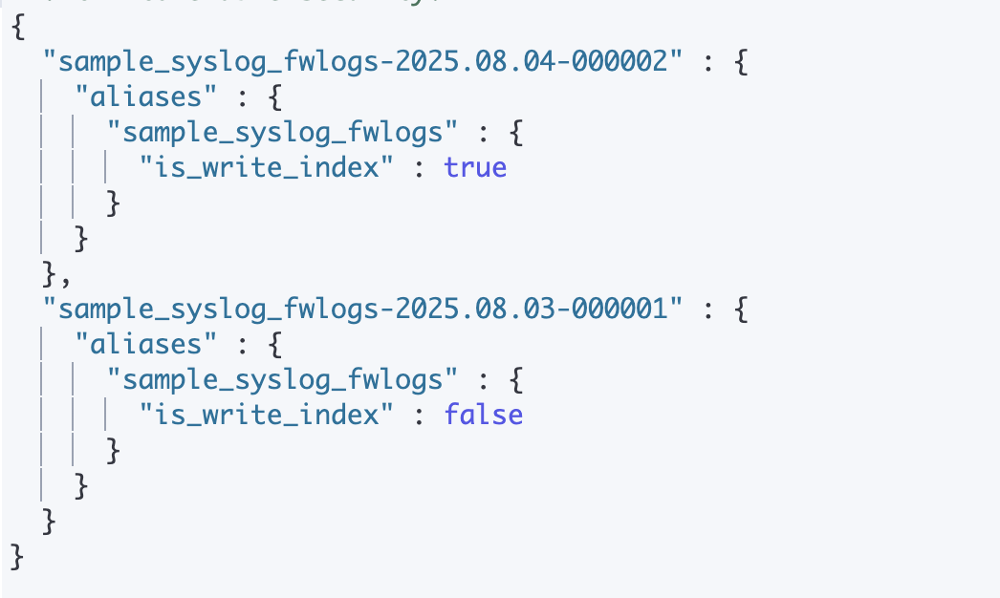
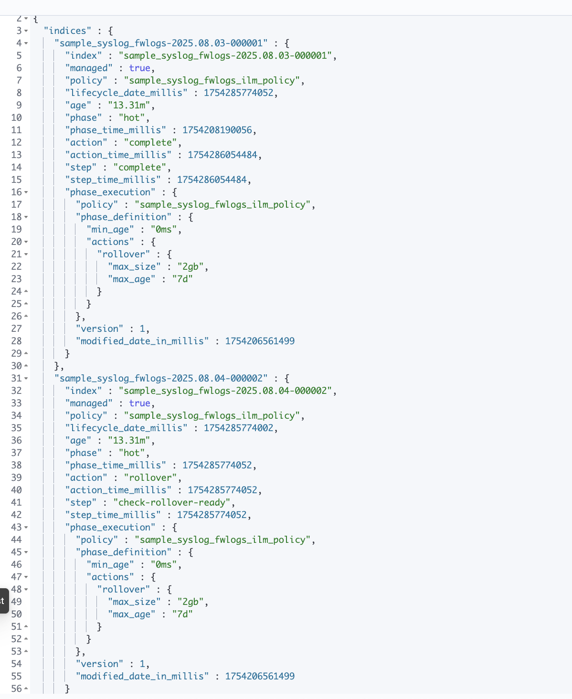
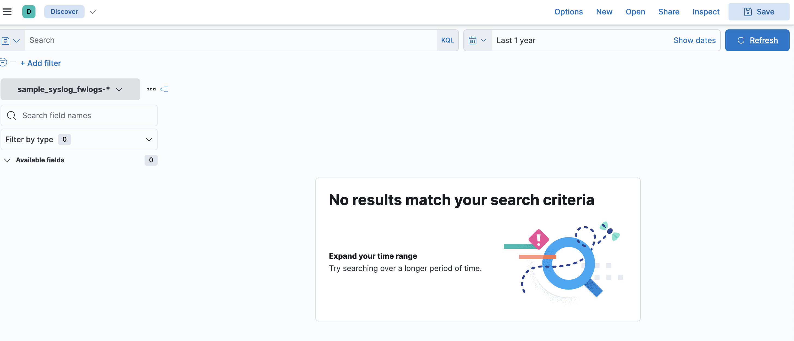

# Simulating Rollover and Retention Using ILM in Elasticsearch

This document demonstrates how to simulate index rollover and retention using **Index Lifecycle Management (ILM)** in Elasticsearch. It builds upon the earlier ingestion of parsed sample syslog firewall logs using Logstash.

---

## 🔍 Goal

Simulate ILM rollover and retention on a legacy-style index (`sample_syslog_fwlogs`) using:
- Manual creation of ILM policy
- Custom index template
- Logstash pipeline using `ilm_enabled => true`
- `POST _rollover` API for manual triggering


---

## 📁 Prerequisites

- ILM policy and index template have been created via Kibana Dev Tools.
- Logs have been successfully ingested using Logstash into Elasticsearch.
- A write alias `sample_syslog_fwlogs` points to the backing index:

GET _alias/sample_syslog_fwlogs

  ```json
  {
    "sample_syslog_fwlogs-2025.08.03-000001": {
      "aliases": {
        "sample_syslog_fwlogs": {
          "is_write_index": true
        }
      }
    }
  }
  ```

  ### ILM Policy Used
 ```json 
  PUT _ilm/policy/sample_syslog_fwlogs_ilm_policy
{
  "policy": {
    "phases": {
      "hot": {
        "actions": {
          "rollover": {
            "max_size": "2gb",
            "max_age": "7d"
          }
        }
      },
      "delete": {
        "min_age": "30d",
        "actions": {
          "delete": {
            "delete_searchable_snapshot": true
          }
        }
      }
    }
  }
}
```

### Index Template Used

```json
PUT _index_template/sample_syslog_fwlogs_template
{
  "index_patterns": ["sample_syslog_fwlogs-*"],
  "template": {
    "settings": {
      "index.lifecycle.name": "sample_syslog_fwlogs_ilm_policy",
      "index.lifecycle.rollover_alias": "sample_syslog_fwlogs"
    },
    "mappings": {
      "properties": {
        "@timestamp": { "type": "date" },
        "src_ip": { "type": "ip" },
        "dst_ip": { "type": "ip" },
        "src_port": { "type": "integer" },
        "dst_port": { "type": "integer" },
        "protocol": { "type": "keyword" },
        "rule_id": { "type": "integer" },
        "user": { "type": "keyword" },
        "app": { "type": "keyword" },
        "threat_level": { "type": "keyword" },
        "bytes_sent": { "type": "long" },
        "bytes_received": { "type": "long" },
        "duration": { "type": "float" },
        "duration_ms": { "type": "keyword" },
        "interface": { "type": "keyword" },
        "event_type": { "type": "keyword" },
        "hostname": { "type": "keyword" }
      }
    }
  }
}
```

### Logstash conf file

```conf
output {
  elasticsearch {
    hosts => ["http://localhost:9200"]
    index => "sample_syslog_fwlogs"
    ilm_enabled => true
    ilm_rollover_alias => "sample_syslog_fwlogs"
    ilm_policy => "sample_syslog_fwlogs_ilm_policy"
  }
}
```

## Simulating Rollover
To trigger rollover manually (without waiting for 7 days or 2 GB), run:
```http
POST sample_syslog_fwlogs/_rollover
```
This create new index like:
sample_syslog_fwlogs-2025.08.03-000002



## Verify

```http
GET _alias/sample_syslog_fwlogs
```
 is_write_index: true moved to the new index.
 

## Simulating Retention

Create old indices manually:
```http
PUT sample_syslog_fwlogs-2025.06.01-000001
```
Apply ILM metadata to it.
Wait or simulate time passing using script.

## Notes
Manual rollover is useful in testing; in production, ILM works automatically.
Use ilm.explain to see ILM phase of any index:

```http
GET sample_syslog_fwlogs-*/_ilm/explain
```



## Simulate Expired Index Deletion
we can't wait 30 days, we’ll manually delete an old index to simulate ILM cleanup.
```http
DELETE /sample_syslog_fwlogs-2025.08.03-000001
```
Only do this if you’ve already verified data in it is backed up or no longer needed.
This simulates what ILM would do after 30d.




