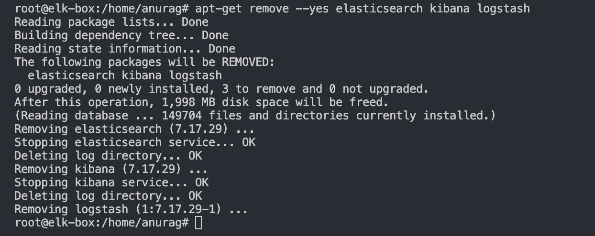
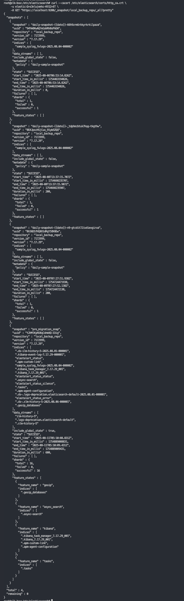
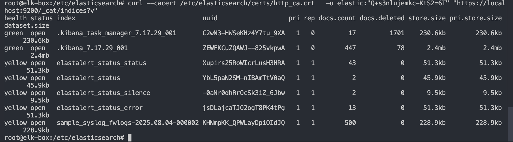

## 1. Stop & Clean old 7.x services
```bash
sudo systemctl stop logstash kibana elasticsearch || true
sudo systemctl disable logstash kibana elasticsearch || true
```

Optionally purge the 7.x packages (configs in /etc/* remain unless you purge fully)

```bash
# If installed via apt
sudo apt-get remove --yes elasticsearch kibana logstash
# or to fully purge configs too (only if you have backups and snapshots)
sudo apt-get purge --yes elasticsearch kibana logstash
sudo apt-get autoremove --yes
```


completely clean environment before installing new ES 8.x -> 9.x
```bash
sudo rm -rf /var/lib/elasticsearch
sudo rm -rf /var/lib/kibana
sudo rm -rf /var/lib/logstash
sudo rm -rf /var/log/logstash
```
Remove Java 11 (ES 9 ships its own JDK), and you’re not using it for anything else
```bash
java -version
# If it's openjdk-11 and you don't need it:
sudo apt-get remove --yes openjdk-11-jre openjdk-11-jdk || true
sudo apt-get autoremove --yes
```

## 2. Install Elasticsearch 8.x (temporary hop)
[ES_8.x_installation](/setup/elasticsearch/8.x/ES_8.x_installation.md)

## 3. Restore your ES 7.x snapshot into ES 8.x
### check health of ES 8.x
```bash
curl --cacert /etc/elasticsearch/certs/http_ca.crt \
     -u elastic:<your_elastic_password> \
     https://localhost:9200
```
```bash
{
  "name" : "elk-box",
  "cluster_name" : "elasticsearch",
  "cluster_uuid" : "XwqKPco6ScqGuH4188TNgA",
  "version" : {
    "number" : "8.19.2",
    "build_flavor" : "default",
    "build_type" : "deb",
    "build_hash" : "c1c00e18ef14acd650768ff01f037eaede0c1f7b",
    "build_date" : "2025-08-11T10:07:54.721189302Z",
    "build_snapshot" : false,
    "lucene_version" : "9.12.2",
    "minimum_wire_compatibility_version" : "7.17.0",
    "minimum_index_compatibility_version" : "7.0.0"
  },
  "tagline" : "You Know, for Search"
}
```

### Register the snapshot repository with TLS
n 8.x, you must use HTTPS + CA certificate.
```bash
curl --cacert /etc/elasticsearch/certs/http_ca.crt \
     -u elastic:<ELASTIC_PASSWORD> \
     -X PUT "https://localhost:9200/_snapshot/local_backup_repo" \
     -H 'Content-Type: application/json' \
     -d '{
           "type": "fs",
           "settings": {
             "location": "/mnt/elastic-backups"
           }
         }'
```
```bash
{"acknowledged":true}
```

### view available snapshot
```bash
curl --cacert /etc/elasticsearch/certs/http_ca.crt \
     -u elastic:<ELASTIC_PASSWORD> \
     -X GET "https://localhost:9200/_snapshot/local_backup_repo/_all?pretty"
```



### Restore the Snapshot
```bash
curl --cacert /etc/elasticsearch/certs/http_ca.crt \
  -u elastic:'YOUR_PASSWORD' \
  -X POST "https://localhost:9200/_snapshot/local_backup_repo/pre_migration_snap/_restore" \
  -H 'Content-Type: application/json' \
  -d '{
    "indices": "*",
    "include_global_state": true
  }'
```

```json
{"accepted":true}
```

### check restore status
```bash
curl --cacert /etc/elasticsearch/certs/http_ca.crt \
  -u elastic:'YOUR_PASSWORD' \
  "https://localhost:9200/_cat/indices?v"
```



## 5. Post Restore Verification Checklist
```bash
export ES_URL="https://localhost:9200"
export ES_CA="/etc/elasticsearch/certs/http_ca.crt"
export ES_USER="elastic"
export ES_PASS="<your_elastic_password>"

alias escurl='curl -s --cacert "$ES_CA" -u "$ES_USER:$ES_PASS"'
```

### cluster is healthy and on 8.x
```bash
escurl "$ES_URL | jq ." 
escurl "$ES_URL/_cluster/health?pretty"
escurl "$ES_URL/_nodes?filter_path=nodes.*.version | jq ." 
```

```bash
root@elk-box:/home/anurag/elk-lab# escurl "$ES_URL/_nodes?filter_path=nodes.*.version" | jq .
{
  "nodes": {
    "I-YQjZXYR8iNo9DgVzQDUQ": {
      "version": "8.19.2"
    }
  }
}
```
```bash
{
  "cluster_name" : "elasticsearch",
  "status" : "yellow",
  "timed_out" : false,
  "number_of_nodes" : 1,
  "number_of_data_nodes" : 1,
  "active_primary_shards" : 21,
  "active_shards" : 21,
  "relocating_shards" : 0,
  "initializing_shards" : 0,
  "unassigned_shards" : 6,
  "unassigned_primary_shards" : 0,
  "delayed_unassigned_shards" : 0,
  "number_of_pending_tasks" : 0,
  "number_of_in_flight_fetch" : 0,
  "task_max_waiting_in_queue_millis" : 0,
  "active_shards_percent_as_number" : 77.77777777777779
}
```

### indices restored and searchables

```bash
escurl "$ES_URL/_cat/indices?v"
escurl "$ES_URL/_cat/shards?v"
# Try a sample search against data
escurl "$ES_URL/sample_syslog_fwlogs-*/_search?size=1&pretty"
```
```bash
root@elk-box:/home/anurag/elk-lab# escurl "$ES_URL/_cat/shards?v"
index                                                         shard prirep state      docs   store dataset ip        node
.kibana_7.17.29_001                                           0     p      STARTED     447   2.4mb   2.4mb 127.0.0.1 elk-box
.ds-ilm-history-7-2025.08.14-000001                           0     p      STARTED     145 429.1kb 429.1kb 127.0.0.1 elk-box
.ds-.logs-deprecation.elasticsearch-default-2025.08.14-000001 0     p      STARTED       1  10.2kb  10.2kb 127.0.0.1 elk-box
sample_syslog_fwlogs-2025.08.14-000003                        0     p      STARTED       0    249b    249b 127.0.0.1 elk-box
sample_syslog_fwlogs-2025.08.14-000003                        0     r      UNASSIGNED                                
.apm-custom-link                                              0     p      STARTED       0    249b    249b 127.0.0.1 elk-box
elastalert_status_silence                                     0     p      STARTED       2   9.5kb   9.5kb 127.0.0.1 elk-box
elastalert_status_silence                                     0     r      UNASSIGNED                                
.apm-agent-configuration                                      0     p      STARTED       0    249b    249b 127.0.0.1 elk-box
.ds-.slm-history-7-2025.08.16-000001                          0     p      STARTED       2  13.2kb  13.2kb 127.0.0.1 elk-box
.kibana-event-log-7.17.29-000001                              0     p      STARTED      12  59.5kb  59.5kb 127.0.0.1 elk-box
elastalert_status_error                                       0     p      STARTED      13  51.3kb  51.3kb 127.0.0.1 elk-box
elastalert_status_error                                       0     r      UNASSIGNED                                
.ds-.slm-history-5-2025.08.06-000001                          0     p      STARTED       3    19kb    19kb 127.0.0.1 elk-box
.async-search                                                 0     p      STARTED       0    254b    254b 127.0.0.1 elk-box
elastalert_status                                             0     p      STARTED       2  45.9kb  45.9kb 127.0.0.1 elk-box
elastalert_status                                             0     r      UNASSIGNED                                
.security-7                                                   0     p      STARTED      33  42.7kb  42.7kb 127.0.0.1 elk-box
.kibana_task_manager_7.17.29_001                              0     p      STARTED      17 230.6kb 230.6kb 127.0.0.1 elk-box
.ds-.logs-deprecation.elasticsearch-default-2025.08.01-000001 0     p      STARTED      21 112.3kb 112.3kb 127.0.0.1 elk-box
.tasks                                                        0     p      STARTED      12  63.8kb  63.8kb 127.0.0.1 elk-box
elastalert_status_status                                      0     p      STARTED      43  51.3kb  51.3kb 127.0.0.1 elk-box
elastalert_status_status                                      0     r      UNASSIGNED                                
.geoip_databases                                              0     p      STARTED       4   3.9mb   3.9mb 127.0.0.1 elk-box
sample_syslog_fwlogs-2025.08.04-000002                        0     p      STARTED     500 228.9kb 228.9kb 127.0.0.1 elk-box
sample_syslog_fwlogs-2025.08.04-000002                        0     r      UNASSIGNED                                
.ds-ilm-history-5-2025.08.01-000001                           0     p      STARTED      22  70.9kb  70.9kb 127.0.0.1 elk-box
root@elk-box:/home/anurag/elk-lab# 
```
```bash
root@elk-box:/home/anurag/elk-lab# escurl "$ES_URL/sample_syslog_fwlogs-*/_search?size=1&pretty"
{
  "took" : 40,
  "timed_out" : false,
  "_shards" : {
    "total" : 2,
    "successful" : 2,
    "skipped" : 0,
    "failed" : 0
  },
  "hits" : {
    "total" : {
      "value" : 500,
      "relation" : "eq"
    },
    "max_score" : 1.0,
    "hits" : [
      {
        "_index" : "sample_syslog_fwlogs-2025.08.04-000002",
        "_id" : "B324c5gBYsgqY5DxZn1-",
        "_score" : 1.0,
        "_ignored" : [
          "message.keyword"
        ],
        "_source" : {
          "timestamp" : "Jul 31 06:19:34",
          "bytes_received" : "4053",
          "event_type" : "syslog_firewall_log",
          ...
          ...

```

### Aliases and rollover look correct
```bash
# All aliases
escurl "$ES_URL/_cat/aliases?v"
# Explain ILM on a current write index
escurl "$ES_URL/sample_syslog_fwlogs-*/_ilm/explain?pretty"
# Dry-run a rollover to confirm alias & conditions are sane (won’t actually roll)
escurl -X POST "$ES_URL/sample_syslog_fwlogs/_rollover?dry_run=true&pretty"
```
**Your rollover alias sample_syslog_fwlogs should point to the latest backing index with "is_write_index": true.**

```bash
root@elk-box:/home/anurag/elk-lab# escurl "$ES_URL/_cat/aliases?v"
alias                        index                                  filter routing.index routing.search is_write_index
.kibana                      .kibana_7.17.29_001                    -      -             -              -
.kibana_7.17.29              .kibana_7.17.29_001                    -      -             -              -
.security                    .security-7                            -      -             -              -
sample_syslog_fwlogs         sample_syslog_fwlogs-2025.08.14-000003 -      -             -              true
.kibana_task_manager         .kibana_task_manager_7.17.29_001       -      -             -              -
.kibana_task_manager_7.17.29 .kibana_task_manager_7.17.29_001       -      -             -              -
.kibana-event-log-7.17.29    .kibana-event-log-7.17.29-000001       -      -             -              true
sample_syslog_fwlogs         sample_syslog_fwlogs-2025.08.04-000002 -      -             -              false
root@elk-box:/home/anurag/elk-lab# 
```
```bash
root@elk-box:/home/anurag/elk-lab# escurl "$ES_URL/sample_syslog_fwlogs-*/_ilm/explain?pretty"
{
  "indices" : {
    "sample_syslog_fwlogs-2025.08.04-000002" : {
      "index" : "sample_syslog_fwlogs-2025.08.04-000002",
      "managed" : true,
      "policy" : "sample_syslog_fwlogs_ilm_policy",
      "index_creation_date_millis" : 1754285774002,
      "time_since_index_creation" : "16.06d",
      "lifecycle_date_millis" : 1755151354119,
      "age" : "6.04d",
      "phase" : "hot",
      "phase_time_millis" : 1754285774052,
      "action" : "complete",
      "action_time_millis" : 1755151354319,
      "step" : "complete",
      "step_time_millis" : 1755151354319,
      "phase_execution" : {
        "policy" : "sample_syslog_fwlogs_ilm_policy",
        "phase_definition" : {
          "min_age" : "0ms",
          "actions" : {
            "rollover" : {
              "max_age" : "7d",
              "max_primary_shard_docs" : 200000000,
              "min_docs" : 1,
              "max_size" : "2gb"
            }
          }
        },
        "version" : 1,
        "modified_date_in_millis" : 1754206561499
      },
      "skip" : false
    }

```
``` bash
root@elk-box:/home/anurag/elk-lab# escurl -X POST "$ES_URL/sample_syslog_fwlogs/_rollover?dry_run=true&pretty"
{
  "acknowledged" : false,
  "shards_acknowledged" : false,
  "old_index" : "sample_syslog_fwlogs-2025.08.14-000003",
  "new_index" : "sample_syslog_fwlogs-2025.08.20-000004",
  "rolled_over" : false,
  "dry_run" : true,
  "lazy" : false,
  "conditions" : { }
}
```

### ilm policy present and attached
```bash
escurl "$ES_URL/_ilm/policy?pretty"
# See what policy each index uses
escurl "$ES_URL/sample_syslog_fwlogs-*/_settings/index.lifecycle.*?pretty"
```
```bash
root@elk-box:/home/anurag/elk-lab# escurl "$ES_URL/sample_syslog_fwlogs-*/_settings/index.lifecycle.*?pretty"
{
  "sample_syslog_fwlogs-2025.08.14-000003" : {
    "settings" : {
      "index" : {
        "lifecycle" : {
          "name" : "sample_syslog_fwlogs_ilm_policy",
          "rollover_alias" : "sample_syslog_fwlogs"
        }
      }
    }
  },
  "sample_syslog_fwlogs-2025.08.04-000002" : {
    "settings" : {
      "index" : {
        "lifecycle" : {
          "name" : "sample_syslog_fwlogs_ilm_policy",
          "rollover_alias" : "sample_syslog_fwlogs",
          "indexing_complete" : "true"
        }
      }
    }
  }
}
```

### template (index & component)
```bash
# Index templates (v2 API)
escurl "$ES_URL/_index_template?pretty"
#if you just want to see names
escurl "$ES_URL/_index_template" | jq '.index_templates[].name'
#to filter just your template
escurl "$ES_URL/_index_template/sample_syslog_fwlogs_template?pretty"


# Component templates
escurl "$ES_URL/_component_template?pretty"
#For particular component template
escurl "$ES_URL/_component_template/sample_syslog_fwlogs*?pretty"
#For just names of component template
escurl "$ES_URL/_component_template" | jq '.component_templates[].name'

# (Optional) legacy v1 templates if any were carried over
escurl "$ES_URL/_template?pretty"
# For particulat Index template
escurl "$ES_URL/_template/sample_syslog_fwlogs?pretty"
# For just names of template
escurl "$ES_URL/_template" | jq 'keys'
```

```bash
root@elk-box:/home/anurag/elk-lab# escurl "$ES_URL/_index_template/sample_syslog_fwlogs_template?pretty"
{
  "index_templates" : [
    {
      "name" : "sample_syslog_fwlogs_template",
      "index_template" : {
        "index_patterns" : [
          "sample_syslog_fwlogs-*"
        ],
        "template" : {
          "settings" : {
            "index" : {
              "lifecycle" : {
                "name" : "sample_syslog_fwlogs_ilm_policy",
                "rollover_alias" : "sample_syslog_fwlogs"
              }
            }
          },
          "mappings" : {
            "properties" : {
              "app" : {
                "type" : "keyword"
              },
              "threat_level" : {
                "type" : "keyword"
              },
              "bytes_received" : {
                "type" : "long"
              },
              "interface" : {
                "type" : "keyword"
              },
              "bytes_sent" : {
                "type" : "long"
              },
              "dst_ip" : {
                "type" : "ip"
              },
              "src_ip" : {
                "type" : "ip"
              },
              "src_port" : {
                "type" : "integer"
              },
              "rule_id" : {
                "type" : "integer"
              },
              "duration" : {
                "type" : "float"
              },
              "duration_ms" : {
                "type" : "keyword"
              },
              "protocol" : {
                "type" : "keyword"
              },
              "hostname" : {
                "type" : "keyword"
              },
              "@timestamp" : {
                "type" : "date"
              },
              "event_type" : {
                "type" : "keyword"
              },
              "dst_port" : {
                "type" : "integer"
              },
              "user" : {
                "type" : "keyword"
              }
            }
          }
        },
        "composed_of" : [ ]
      }
    }
  ]
}
```

```bash
root@elk-box:/home/anurag/elk-lab# escurl "$ES_URL/_template/sample_syslog_fwlogs?pretty"
{
  "sample_syslog_fwlogs" : {
    "order" : 0,
    "version" : 60001,
    "index_patterns" : [
      "sample_syslog_fwlogs-*"
    ],
    "settings" : {
      "index" : {
        "lifecycle" : {
          "name" : "sample_syslog_fwlogs_ilm_policy",
          "rollover_alias" : "sample_syslog_fwlogs"
        },
        "number_of_shards" : "1",
        "refresh_interval" : "5s"
      }
    },
    "mappings" : {
      "dynamic_templates" : [
        {
          "message_field" : {
            "path_match" : "message",
            "mapping" : {
              "norms" : false,
              "type" : "text"
            },
            "match_mapping_type" : "string"
          }
        },
        {
          "string_fields" : {
            "mapping" : {
              "norms" : false,
              "type" : "text",
              "fields" : {
                "keyword" : {
                  "ignore_above" : 256,
                  "type" : "keyword"
                }
              }
            },
            "match_mapping_type" : "string",
            "match" : "*"
          }
        }
      ],
      "properties" : {
        "@timestamp" : {
          "type" : "date"
        },
        "geoip" : {
          "dynamic" : true,
          "properties" : {
            "ip" : {
              "type" : "ip"
            },
            "latitude" : {
              "type" : "half_float"
            },
            "location" : {
              "type" : "geo_point"
            },
            "longitude" : {
              "type" : "half_float"
            }
          }
        },
        "@version" : {
          "type" : "keyword"
        }
      }
    },
    "aliases" : { }
  }
}
```
delete the legacy _template for sample_syslog_fwlogs for future compatibility for ES 9.x

### Ingest Pipeline
```bash
escurl "$ES_URL/_ingest/pipeline?pretty"

# to filter specific pipeline
escurl "$ES_URL/_ingest/pipeline/sample_syslog_fwlogs_pipeline?pretty"

# to filer all pipeline just names
escurl "$ES_URL/_ingest/pipeline" | jq 'keys'
```

```bash
root@elk-box:/home/anurag/elk-lab# escurl "$ES_URL/_ingest/pipeline" | jq 'keys'
[
  "apm@pipeline",
  "behavioral_analytics-events-final_pipeline",
  "ent-search-generic-ingestion",
  "logs-apm.app@default-pipeline",
  "logs-apm.error@default-pipeline",
  "logs-apm@pipeline",
  "logs-default-pipeline",
  "logs@default-pipeline",
  "logs@json-message",
  "logs@json-pipeline",
  "metrics-apm.app@default-pipeline",
  "metrics-apm.internal@default-pipeline",
  "metrics-apm.service_destination@default-pipeline",
  "metrics-apm.service_summary@default-pipeline",
  "metrics-apm.service_transaction@default-pipeline",
  "metrics-apm.transaction@default-pipeline",
  "metrics-apm@pipeline",
  "reindex-data-stream-pipeline",
  "search-default-ingestion",
  "traces-apm.rum@default-pipeline",
  "traces-apm@default-pipeline",
  "traces-apm@pipeline",
  "xpack_monitoring_6",
  "xpack_monitoring_7"
]
```

### snapshot repository and snapshots
```bash
escurl "$ES_URL/_snapshot/_all?pretty"
escurl "$ES_URL/_snapshot/<your_repo>/_all?pretty"
```

```bash
root@elk-box:/home/anurag/elk-lab# escurl "$ES_URL/_snapshot/_all?pretty"
{
  "local_backup_repo" : {
    "type" : "fs",
    "uuid" : "Azyl6NBvQtuYIlE05aCGlw",
    "settings" : {
      "location" : "/mnt/elastic-backups"
    }
  }
}
```

### cluster settings (including disk watermark setting we tempared earlier)
```bash
# View current + defaults (flat for easy grep)
escurl "$ES_URL/_cluster/settings?include_defaults=true&flat_settings=true&pretty"

#look for settings that you override ignore defaults
escurl "$ES_URL/_cluster/settings?flat_settings=true&pretty" | jq .

```
```bash
root@elk-box:/home/anurag/elk-lab# escurl "$ES_URL/_cluster/settings?flat_settings=true&pretty" | jq .
{
  "persistent": {},
  "transient": {}
}
```

### Depreciations for ES 9.x readiness
```bash
# Cluster-level deprecations
escurl "$ES_URL/_migration/deprecations?pretty"
```


```bash
# Index-level deprecations
for i in $(escurl "$ES_URL/_cat/indices?h=index" | tr -d '\r'); do
  echo "== $i =="; escurl "$ES_URL/$i/_migration/deprecations?pretty";
done
```

```bash
    "sample_syslog_fwlogs-2025.08.04-000002" : [
      {
        "level" : "critical",
        "message" : "Old index with a compatibility version < 8.0",
        "url" : "https://ela.st/es-deprecation-9-index-version",
        "details" : "This index has version: 7.17.29",
        "resolve_during_rolling_upgrade" : false,
        "_meta" : {
          "reindex_required" : true
        }
      }
    ]
```
sample_syslog_fwlogs must need to be reindexed before moving to ES 9.x

#### reindexing index before migrating to ES 9.x

[Reindex_index_ES_8.x_compatible](/docs/Reindexing_index_ES_8.x_compatibility.md)


### Security Sanity
```bash
# Built-in users & roles exist (just a quick peek)
escurl "$ES_URL/_security/user?pretty"
```

```json
  "kibana_system" : {
    "username" : "kibana_system",
    "roles" : [
      "kibana_system"
    ],
    "full_name" : null,
    "email" : null,
    "metadata" : {
      "_reserved" : true
    },
    "enabled" : true
  },
  "logstash_system" : {
    "username" : "logstash_system",
    "roles" : [
      "logstash_system"
    ],
    "full_name" : null,
    "email" : null,
    "metadata" : {
      "_reserved" : true
    },
    "enabled" : true
  },
  "beats_system" : {
    "username" : "beats_system",
    "roles" : [
      "beats_system"
    ],
    "full_name" : null,
    "email" : null,
    "metadata" : {
      "_reserved" : true
    },
    "enabled" : true
  },
  "apm_system" : {
    "username" : "apm_system",
    "roles" : [
      "apm_system"
    ],
    "full_name" : null,
    "email" : null,
    "metadata" : {
      "_reserved" : true
    },
    "enabled" : true
  },
  "remote_monitoring_user" : {
    "username" : "remote_monitoring_user",
    "roles" : [
      "remote_monitoring_collector",
      "remote_monitoring_agent"
    ],
    "full_name" : null,
    "email" : null,
    "metadata" : {
      "_reserved" : true
    },
    "enabled" : true
  }
}
```

```bash
escurl "$ES_URL/_security/role?pretty"
```
```bash
root@elk-box:/etc/elasticsearch/certs# escurl "$ES_URL/_security/role?pretty" | jq 'keys'
[
  "apm_system",
  "apm_user",
  "beats_admin",
  "beats_system",
  "data_frame_transforms_admin",
  "data_frame_transforms_user",
  "editor",
  "enrich_user",
  "inference_admin",
  "inference_user",
  "ingest_admin",
  "kibana_admin",
  "kibana_system",
  "kibana_user",
  "logstash_admin",
  "logstash_system",
  "machine_learning_admin",
  "machine_learning_user",
  "monitoring_user",
  "remote_monitoring_agent",
  "remote_monitoring_collector",
  "reporting_user",
  "rollup_admin",
  "rollup_user",
  "snapshot_user",
  "superuser",
  "transform_admin",
  "transform_user",
  "transport_client",
  "viewer",
  "watcher_admin",
  "watcher_user"
]
```

### License

```bash
# License status (basic/trial)
escurl "$ES_URL/_license?pretty"
```
```json
{
  "license" : {
    "status" : "active",
    "uid" : "5790a13d-9d11-4ef1-901e-9a4b5761162b",
    "type" : "basic",
    "issue_date" : "2025-08-14T03:52:35.691Z",
    "issue_date_in_millis" : 1755143555691,
    "max_nodes" : 1000,
    "max_resource_units" : null,
    "issued_to" : "elasticsearch",
    "issuer" : "elasticsearch",
    "start_date_in_millis" : -1
  }
}
```

## 6. Test write path

```bash
escurl -X POST "$ES_URL/sample_syslog_fwlogs/_doc?refresh=true" -H 'Content-Type: application/json' -d '{
  "@timestamp": "'$(date -u +%FT%TZ)'",
  "event_type": "smoke_test",
  "host": "elk-box",
  "bytes_sent": 1234,
  "src_ip": "192.168.1.10",
  "dst_ip": "8.8.8.8"
}'
```
```json
{"_index":"sample_syslog_fwlogs-2025.08.30-000001","_id":"RhlQ_5gBxgyS1sydPlgd","_version":1,"result":"created","forced_refresh":true,"_shards":{"total":2,"successful":1,"failed":0},"_seq_no":500,"_primary_term":1}
```

```bash
# Confirm it landed
escurl "$ES_URL/sample_syslog_fwlogs-*/_search?q=event_type:smoke_test&size=1&pretty"
```
```json
root@elk-box:/etc/elasticsearch/certs# escurl "$ES_URL/sample_syslog_fwlogs-*/_search?q=event_type:smoke_test&size=1&pretty"
{
  "took" : 96,
  "timed_out" : false,
  "_shards" : {
    "total" : 3,
    "successful" : 3,
    "skipped" : 0,
    "failed" : 0
  },
  "hits" : {
    "total" : {
      "value" : 1,
      "relation" : "eq"
    },
    "max_score" : 5.813135,
    "hits" : [
      {
        "_index" : "sample_syslog_fwlogs-2025.08.30-000001",
        "_id" : "RhlQ_5gBxgyS1sydPlgd",
        "_score" : 5.813135,
        "_source" : {
          "@timestamp" : "2025-08-31T08:48:25Z",
          "event_type" : "smoke_test",
          "host" : "elk-box",
          "bytes_sent" : 1234,
          "src_ip" : "192.168.1.10",
          "dst_ip" : "8.8.8.8"
        }
      }
    ]
  }
}
```

### everything is clean

take a fresh 8.x snapshot (this becomes your source of truth for the 9.x restore):

#### create a new repo for migration snapshot from ES 8.x to ES 9.x

```bash

escurl -X PUT "$ES_URL/_snapshot/9x_migration_repo" -H 'Content-Type: application/json' -d '{
  "type": "fs",
  "settings": {
    "location": "/mnt/9x-elastic-backups",
    "compress": true
  }
}'
```

```json 
{"acknowledged":true}
```

```bash
icsearch/certs# escurl "$ES_URL/_snapshot?pretty"
{
  "local_backup_repo" : {
    "type" : "fs",
    "uuid" : "Azyl6NBvQtuYIlE05aCGlw",
    "settings" : {
      "location" : "/mnt/elastic-backups"
    }
  },
  "9x_migration_repo" : {
    "type" : "fs",
    "uuid" : "Azyl6NBvQtuYIlE05aCGlw",
    "settings" : {
      "compress" : "true",
      "location" : "/mnt/9x-elastic-backups"
    }
  }
}
```


```bash
escurl -X PUT "$ES_URL/_snapshot/9x_migration_repo/pre_9x_migration_$(date -u +%Y%m%d%H%M%S)" \
  -H 'Content-Type: application/json' -d '{
  "indices": "*",
  "include_global_state": true
}' | jq .

```
```json
{
  "accepted": true
}
```

### check snapshot status

```bash 
escurl "$ES_URL/_snapshot/9x_migration_repo/_all?pretty"
```

```json
  "snapshots" : [
    {
      "snapshot" : "pre_9x_migration_20250902054505",
      "uuid" : "8Qn9HOeLSkOSDPrQgZ4MXA",
      "repository" : "9x_migration_repo",
      "version_id" : 8536000,
      "version" : "8.19.0-8.19.2",
      "indices" : [
        "elastalert_status",
        ".geoip_databases",
        ".ds-.logs-deprecation.elasticsearch-default-2025.08.14-000001",
        "sample_syslog_fwlogs-2025.08.14-000003",
        ".ds-.slm-history-7-2025.08.30-000003",
        ".ds-ilm-history-5-2025.08.31-000002",
        ".ds-ilm-history-7-2025.08.21-000002",
        "elastalert_status_status",
        ".ds-ilm-history-7-2025.08.14-000001",
        ".apm-agent-configuration",
        ".ds-ilm-history-5-2025.08.01-000001",
        ".ds-.logs-deprecation.elasticsearch-default-2025.08.01-000001",
        ".apm-custom-link",
        "elastalert_status_error",
        ".tasks",
        "sample_syslog_fwlogs-test",
        ".kibana_7.17.29_001",
        ".async-search",
        ".ds-.slm-history-7-2025.08.16-000001",
        ".ds-.slm-history-7-2025.08.23-000002",
        ".kibana-event-log-7.17.29-000002",
        ".kibana_task_manager_7.17.29_001",
        ".kibana-event-log-7.17.29-000001",
        ".ds-.slm-history-5-2025.08.06-000001",
        "sample_syslog_fwlogs-2025.08.30-000001",
        ".ds-ilm-history-7-2025.08.30-000003",
        "elastalert_status_silence",
        ".ds-.logs-deprecation.elasticsearch-default-2025.08.31-000002",
        ".security-7"
      ],
```

