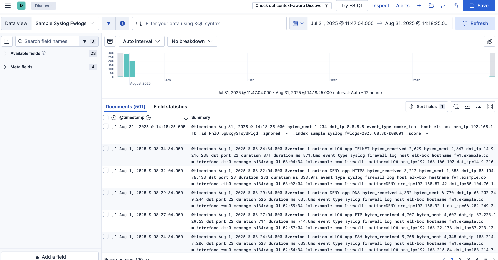

## 1. Stop and Clean ES 8.x Services

```bash
sudo systemctl stop elasticsearch 
sudo systemctl disable elasticsearch
```

```bash
Removed /etc/systemd/system/multi-user.target.wants/elasticsearch.service.
```

Optionally purge the 8.x packages (configs in /etc/* remain unless you purge fully)

```bash
# If installed via apt
sudo apt-get remove --yes elasticsearch 
# or to fully purge configs too (only if you have backups and snapshots)
sudo apt-get purge --yes elasticsearch 
```

## 2 Remove Elasticsearch data, logs, and config
```bash
sudo rm -rf /var/lib/elasticsearch
sudo rm -rf /var/log/elasticsearch
sudo rm -rf /etc/elasticsearch
sudo rm -rf /usr/share/elasticsearch
```

## 3. Install Es 9.x

[ES_9.x_installation](/setup/elasticsearch/9.x/ES_9.x_installation.md)

## 4. Restoration of Data

### Register Snapshot Repository in ES 9.x

**make sure to include path.repo in elasticsearch.yml includes /mnt/9x-elastic-backups**

```bash
escurl -X PUT "$ES_URL/_snapshot/9x_migration_repo" \
  -H 'Content-Type: application/json' -d '{
    "type": "fs",
    "settings": {
      "location": "/mnt/9x-elastic-backups",
      "compress": true
    }
  }' | jq .
```

```json
{
  "acknowledged": true
}
```

### Check available snapshot

```bash
escurl "$ES_URL/_snapshot/9x_migration_repo/_all?pretty"
```

```json
{
  "snapshots": [
    {
      "snapshot": "pre_9x_migration_20250902054505",
      "uuid": "8Qn9HOeLSkOSDPrQgZ4MXA",
      "repository": "9x_migration_repo",
      "version_id": 8536000,
      "version": "8.19.0-8.19.2",
      "indices": [
        "elastalert_status",
        ".geoip_databases",
        ".ds-.logs-deprecation.elasticsearch-default-2025.08.14-000001",
        "sample_syslog_fwlogs-2025.08.14-000003",
        ".ds-.slm-history-7-2025.08.30-000003",
        ".ds-ilm-history-5-2025.08.31-000002",
        ".ds-ilm-history-7-2025.08.21-000002",
        "elastalert_status_status",
        ".ds-ilm-history-7-2025.08.14-000001",
        ".apm-agent-configuration",
        ".ds-ilm-history-5-2025.08.01-000001",
        ".ds-.logs-deprecation.elasticsearch-default-2025.08.01-000001",
        ".apm-custom-link",
        "elastalert_status_error",
        ".tasks",
        "sample_syslog_fwlogs-test",
        ".kibana_7.17.29_001",
        ".async-search",
        ".ds-.slm-history-7-2025.08.16-000001",
        ".ds-.slm-history-7-2025.08.23-000002",
        ".kibana-event-log-7.17.29-000002",
        ".kibana_task_manager_7.17.29_001",
        ".kibana-event-log-7.17.29-000001",
        ".ds-.slm-history-5-2025.08.06-000001",
        "sample_syslog_fwlogs-2025.08.30-000001",
        ".ds-ilm-history-7-2025.08.30-000003",
        "elastalert_status_silence",
        ".ds-.logs-deprecation.elasticsearch-default-2025.08.31-000002",
        ".security-7"
      ],
      "data_streams": [
        "ilm-history-5",
        "ilm-history-7",
        ".slm-history-7",
        ".slm-history-5",
        ".logs-deprecation.elasticsearch-default"
      ],
      "include_global_state": true,
      "state": "SUCCESS",
      "start_time": "2025-09-02T05:45:05.780Z",
      "start_time_in_millis": 1756791905780,
      "end_time": "2025-09-02T05:45:05.980Z",
      "end_time_in_millis": 1756791905980,
      "duration_in_millis": 200,
      "failures": [],
      "shards": {
        "total": 29,
        "failed": 0,
        "successful": 29
      },
      "feature_states": [
        {
          "feature_name": "geoip",
          "indices": [
            ".geoip_databases"
          ]
        },
        {
          "feature_name": "async_search",
          "indices": [
            ".async-search"
          ]
        },
        {
          "feature_name": "tasks",
          "indices": [
            ".tasks"
          ]
        },
        {
          "feature_name": "kibana",
          "indices": [
            ".kibana_task_manager_7.17.29_001",
            ".kibana_7.17.29_001",
            ".apm-custom-link",
            ".apm-agent-configuration"
          ]
        },
        {
          "feature_name": "security",
          "indices": [
            ".security-7"
          ]
        }
      ]
    }
  ],
  "total": 1,
  "remaining": 0
}
```

### Restore Data
**pick latest snapshot**

```bash
escurl -X POST "$ES_URL/_snapshot/9x_migration_repo/pre_9x_migration_20250906090000/_restore" \
  -H 'Content-Type: application/json' -d '{
    "indices": "*",
    "include_global_state": true
  }' | jq .

```
**Find below attached file to address error occured during this stage**
[Resolve_Comp_issue_ES7_in_ES9](/docs/Resolve_compatibility_issue_ES7_in_ES9.md)

```json
{
  "accepted": true
}
```


## 5. Verification of Data

### check indices
```bash
escurl "$ES_URL/_cat/indices?v"
```

```json
yellow open sample_syslog_fwlogs-2025.08.30-000001 NqDzHkMySAGw7JZ3dqTAKg 1 1 501 0 230.1kb 230.1kb 230.1kb
```

### check aliases
```bash
escurl "$ES_URL/_cat/aliases/sample_syslog_fwlogs*?v"
```

```json
alias                index                                  filter routing.index routing.search is_write_index
sample_syslog_fwlogs sample_syslog_fwlogs-2025.08.30-000001 -      -             -              true
```

### check ilm policy

```json
GET sample_syslog_fwlogs-*/_ilm/explain
```

### check _index_template
```json
GET _index_template/sample_syslog_fwlogs*
```

### check data in data steam
