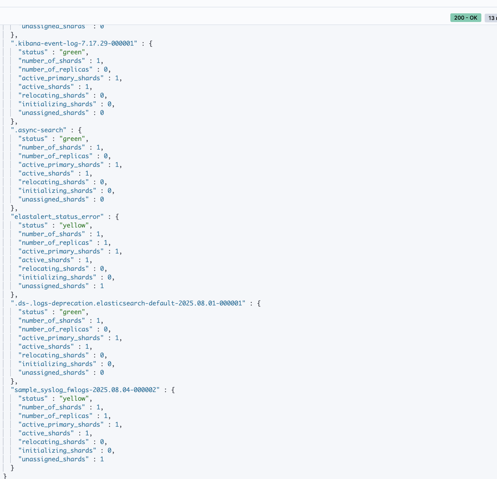
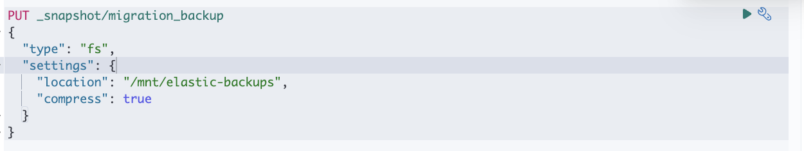
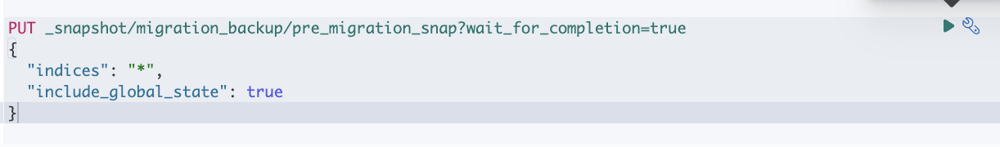
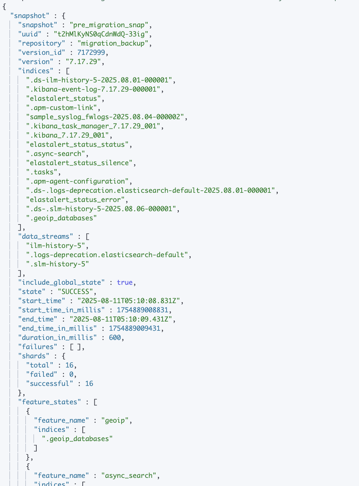
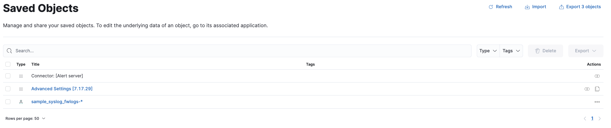

# Before Migration Must Do

## 1. Verifty Data Integrity in 7.x
### check index health
All indices should be green (or at least yellow if single-node).
```bash
GET _cluster/health?level=indices
```


### check documents counts
Note counts for later comparison
```bash
GET _cat/indices?v
```


## 2. Backup Everything (snapshot)
Register a snapshot repo (local fs is fine):


Take full snapshot



Copy snapshot folder to safe location outside VM in case migration fails.


## 3. Export Configuration
Save these for documentation & easy re-import:
### 1. Index Template
[index_template](./config%20files/Index_template.md)
[get_template](./config%20files/template.md)

### 2. ILM Policies
[get_ilm_policy](./config%20files/get_ilm_policy.md)

### 3. Role/role mapping (if enabled)
[get_security_role](./config%20files/get_security_role.md)
[get_security_role_mapping](./config%20files/get_security_role_mapping.md)
## 4. Kibana saved object
(via Kibana → Stack Management → Saved Objects → Export All)

## 5. Logstash Pipeline configs
from /etc/logstash/conf.d

[logstash_pipeline](/config/logstash/7.x/sample_fwlogs_pipeline.conf)

## 6. List all plugins
so you can reinstall compatible version in 9.x
```bash
./bin/elasticsearch-plugin list
```

## 7. check all deprecated settings & APIs
```bash
GET _migration/deprecations
```
```json
{
  "cluster_settings" : [ ],
  "node_settings" : [
    {
      "level" : "warning",
      "message" : "Disk watermarks do not treat single-node clusters differently in versions 8.0 and later.",
      "url" : "https://ela.st/es-deprecation-7-disk-watermark-enable-for-single-node-setting",
      "details" : "Disk watermarks do not treat single-node clusters differently in versions 8.0 and later, which will affect the behavior of this cluster. Set [cluster.routing.allocation.disk.watermark.enable_for_single_data_node] to [true] to adopt the future behavior before upgrading. (nodes impacted: [elk-box, elk-box])",
      "resolve_during_rolling_upgrade" : false
    }
  ],
  "index_settings" : { },
  "ml_settings" : [ ],
  "ccr_auto_followed_system_indices" : [ ]
}
```

This is minor and not a blocker. You can fix it now to avoid seeing warnings post-upgrade:
You’d need to set it in the elasticsearch.yml file instead:

``` bash
sudo nano /etc/elasticsearch/elasticsearch.yml
```
```yml
cluster.routing.allocation.disk.watermark.enable_for_single_data_node: true
```

```bash
systemctl restart elasticsearch
```
after resolution
```json
{
  "cluster_settings" : [ ],
  "node_settings" : [ ],
  "index_settings" : { },
  "ml_settings" : [ ],
  "ccr_auto_followed_system_indices" : [ ]
}
```

## 8. Note your elasticsearch java version
7.x may run on older Java than 9.x supports.
```bash
java --version
```
ES 9.x requires Java 21 if using external JDK

```bash
11.0.28
```

## 9. Put the cluster in read-only  mode
```bash
PUT _cluster/settings
{
  "persistent": {
    "cluster.blocks.read_only": true
  }
}
```

```json
{
  "acknowledged" : true,
  "persistent" : {
    "cluster" : {
      "blocks" : {
        "read_only" : "true"
      }
    }
  },
  "transient" : { }
}
```