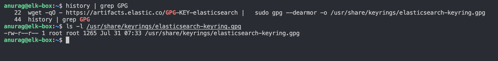
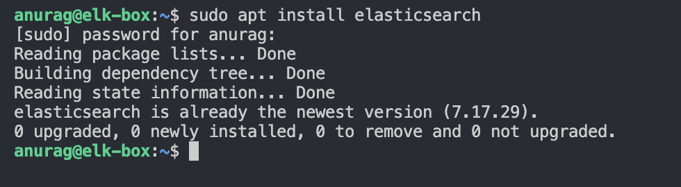
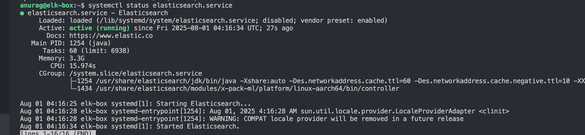
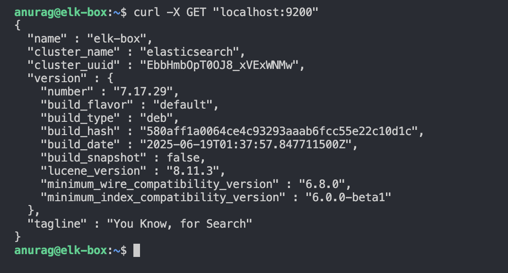

✅ Prerequisites
Ubuntu 22.04+ (CLI-based)

Java 11 (OpenJDK)

Internet connection

Sudo privileges

🛠 Step-by-Step Installation (Elasticsearch 7.x)

# 1. Install Java 11
sudo apt update
sudo apt install openjdk-11-jdk -y

# Verify Java installation
java -version

## Java Version Check

# 2. Import the Elasticsearch GPG Key
wget -qO - https://artifacts.elastic.co/GPG-KEY-elasticsearch | \
  sudo gpg --dearmor -o /usr/share/keyrings/elasticsearch-keyring.gpg

  ## GPG Key Added

# 3. Add Elasticsearch 7.x APT repository
echo "deb [signed-by=/usr/share/keyrings/elasticsearch-keyring.gpg] \
  https://artifacts.elastic.co/packages/7.x/apt stable main" | \
  sudo tee /etc/apt/sources.list.d/elastic-7.x.list

  ## Repository Added

# 4. Update repo and install Elasticsearch
sudo apt update
sudo apt install elasticsearch -y

## Elasticsearch Install Success

# 5. Enable and start the service
sudo systemctl enable elasticsearch
sudo systemctl start elasticsearch

# Check status
sudo systemctl status elasticsearch

## Elasticsearch Service Status

# To test if ES is running
curl -X GET "localhost:9200"

## Elasticsearch Version Check

