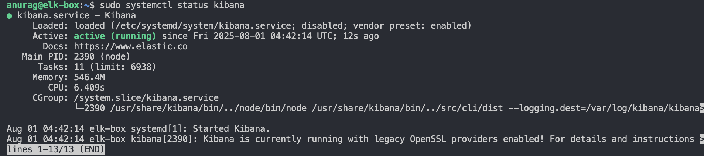

# Kibana 7.x Installation

This document outlines the steps followed to install and configure Kibana 7.x on an Ubuntu virtual machine as part of the ELK migration simulation project.

---

## 🔧 Step 1: Add GPG Key (Modern Method)

```bash
curl -fsSL https://artifacts.elastic.co/GPG-KEY-elasticsearch | gpg --dearmor | sudo tee /usr/share/keyrings/elastic.gpg > /dev/null

```

## Step 2: Add Kibana APT Repository

```bash
echo "deb [signed-by=/usr/share/keyrings/elastic.gpg] https://artifacts.elastic.co/packages/7.x/apt stable main" | sudo tee /etc/apt/sources.list.d/elastic-7.x.list
sudo apt update
```

## Step 3: Install Kibana

sudo apt install kibana

## Step 4: Enable and Start Kibana Service

sudo systemctl enable kibana
sudo systemctl start kibana

### check kibana status



## Step 5: Configure kibana to Allow External Access
```bash
sudo nano /etc/kibana/kibana.yml
```

uncomment the following line in kibana.yml file

server.host: "0.0.0.0"
```bash
sudo systemctl restart kibana
```

## Step 6: Access Kibana in Browser
http://vm-ip:5601


