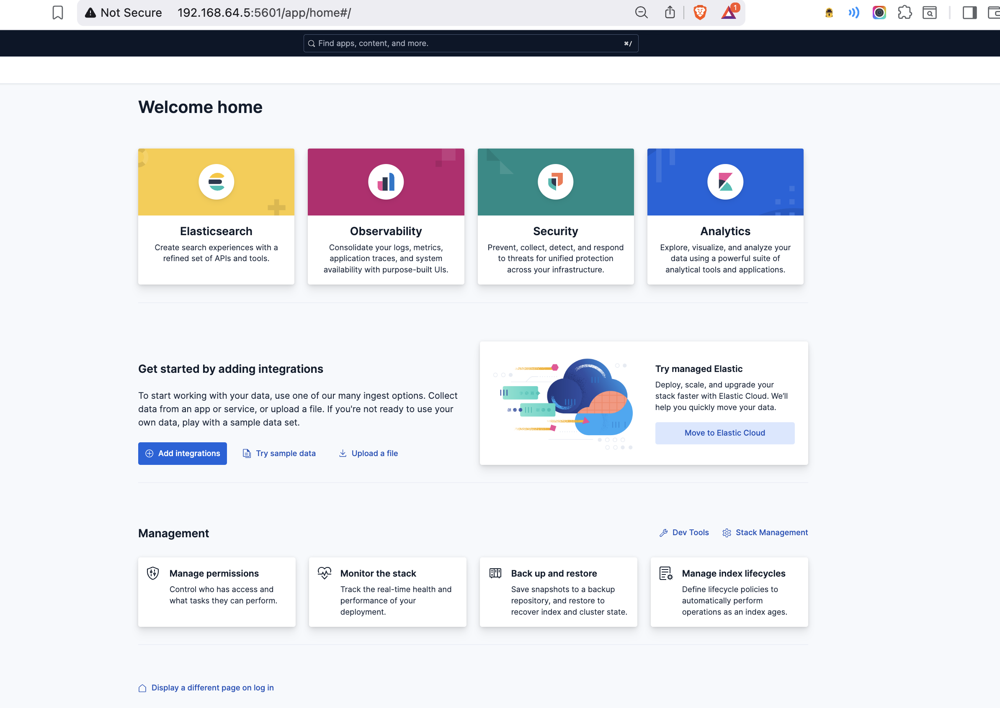

# Kibana 9.x Installation

This document outlines the steps followed to install and configure Kibana 9.x on an Ubuntu virtual machine as part of the ELK migration simulation project.

---

## 🔧 Step 1: Add GPG Key (Modern Method)

```bash
wget -qO - https://artifacts.elastic.co/GPG-KEY-elasticsearch | sudo gpg --dearmor -o /usr/share/keyrings/elasticsearch-keyring.gpg
```

## Step 2: Add Kibana APT Repository

```bash
echo "deb [signed-by=/usr/share/keyrings/elasticsearch-keyring.gpg] https://artifacts.elastic.co/packages/9.x/apt stable main" | sudo tee /etc/apt/sources.list.d/elastic-9.x.list
sudo apt update
```

## Step 3: Install Kibana

sudo apt install kibana

## Step 4: Generate Enrollment Token
```bash
/usr/share/elasticsearch/bin/elasticsearch-create-enrollment-token -s kibana
```


## Step 5: Configure kibana to Allow External Access
```bash
sudo nano /etc/kibana/kibana.yml
```

```yml
server.host: "0.0.0.0"
# elasticsearch.hosts: ["https://localhost:9200"]
# elasticsearch.username: "kibana_system"
# elasticsearch.password: "<password>"
# elasticsearch.ssl.certificateAuthorities: ["/etc/elasticsearch/certs/http_ca.crt"]
```

## Step 4: Enable and Start Kibana Service

sudo systemctl enable kibana
sudo systemctl start kibana

## Step 5: Generate Kibana Enrollment Token

```bash
/usr/share/elasticsearch/bin/elasticsearch-create-enrollment-token -s kibana
```

### generate kibana-verification-code

```bash
/usr/share/kibana/bin/kibana-verification-code
```
**navigate to url http://<vm-ip>:5601/**,
**then enroll kibana using enrollment token and verification code**


## Step 6: Access Kibana in Browser
http://vm-ip:5601




