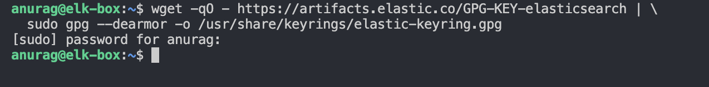
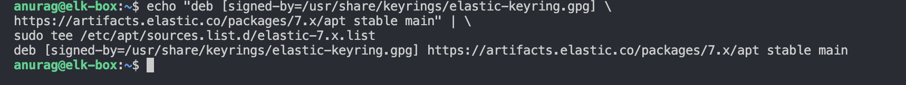
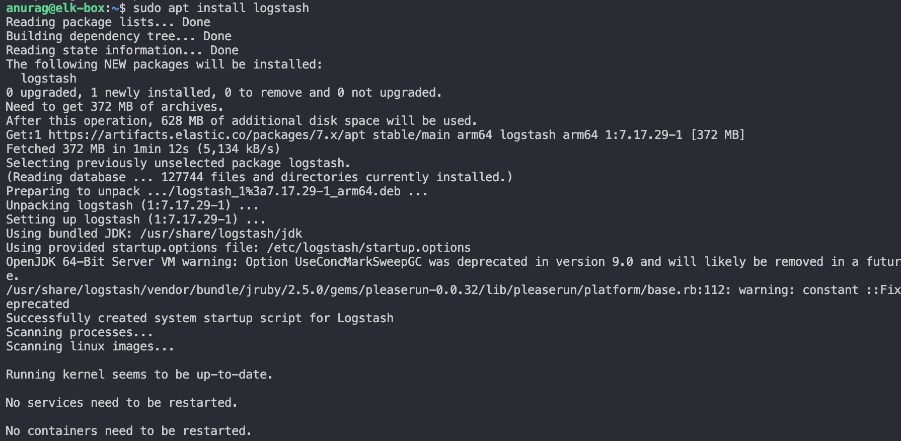
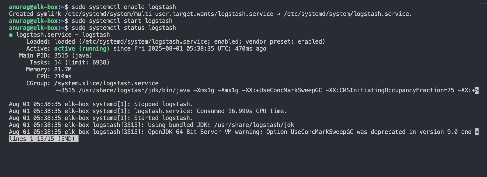

# 📦 Logstash Installation (7.x)

This guide documents the steps to install **Logstash 7.x** on a virtual machine for the purpose of ELK stack simulation and migration testing.

---


---

## 🔧 Prerequisites

- Java 11 (already installed for Elasticsearch)
- Ubuntu 20.04 or later
- Elasticsearch 7.x installed and running

---

## 🛠️ Installation Steps

###  1. Add GPG Key

```bash
wget -qO - https://artifacts.elastic.co/GPG-KEY-elasticsearch | \
  sudo gpg --dearmor -o /usr/share/keyrings/elastic-keyring.gpg
```


### 2. Add logstash APT Repository

```bash
echo "deb [signed-by=/usr/share/keyrings/elastic-keyring.gpg] \
https://artifacts.elastic.co/packages/7.x/apt stable main" | \
sudo tee /etc/apt/sources.list.d/elastic-7.x.list
```


### 3. update and install logstash
```bash
sudo apt update
sudo apt install logstash
```


### 4. Enable and Start Logstash Servic
```bash
sudo systemctl enable logstash
sudo systemctl start logstash
sudo systemctl status logstash
```


### 5. Verify Logstash Version
```bash
/usr/share/logstash/bin/logstash --version
```


